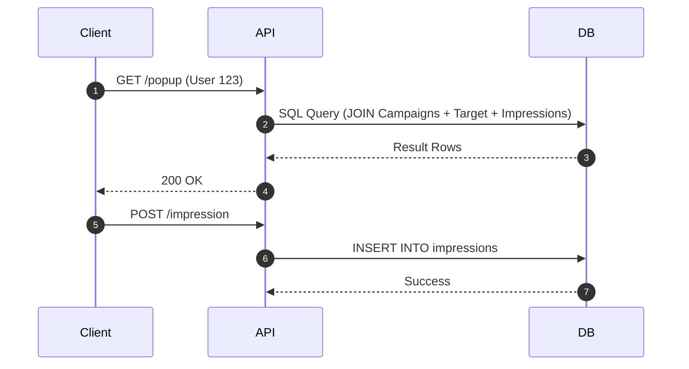
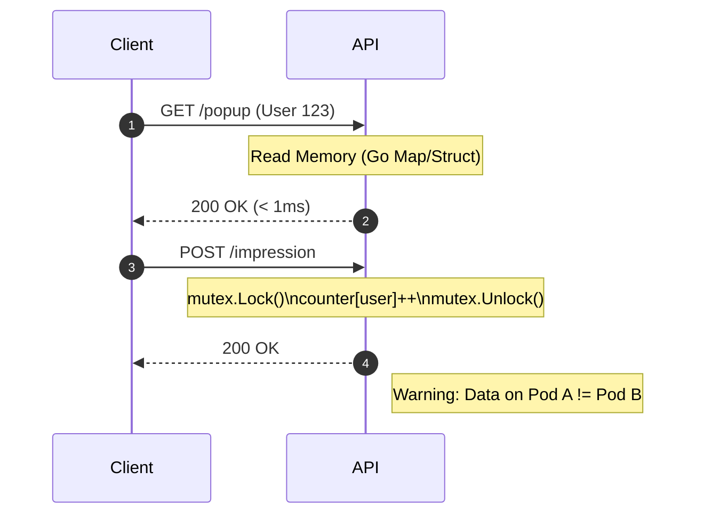

# Alternative Designs: Campaign Popup (No Redis)

Dokumen ini menjelaskan alternatif solusi untuk sistem Campaign Popup jika **tidak menggunakan Redis**. Analisis ini membandingkan pendekatan **Pure Database** dan **In-Memory Cache** dengan solusi Redis yang sudah ada.

## Problem Context
Requirement utama adalah **Low Latency (<50ms)** dan **High Traffic**. Menghapus Redis berarti kita memindahkan beban baca/tulis ke layer lain.

---

## Option 1: Pure PostgreSQL (Database Centric)

Pendekatan ini mengandalkan optimasi database untuk menangani read traffic dan write impression.

### Architecture
1.  **Read (`GET /popup`)**: Query langsung ke tabel `campaigns` dan join ke `campaign_targets` / `campaign_impressions`.
2.  **Tracking (`POST /impression`)**: Insert/Update langsung ke tabel `campaign_impressions`.



### Optimization Strategy
*   **Indexing**: Index pada `is_active`, `start_time`, `end_time`, `priority`.
*   **Read Replicas**: Memisahkan traffic baca ke Follower DB untuk mengurangi beban Master.
*   **Impression Handling**: Jangan update row setiap hit. Gunakan `INSERT` log lalu agregasi (batch job) untuk cek frequency cap, ATAU gunakan **Unlogged Tables** di Postgres untuk performa tulis tinggi (resiko data hilang jika crash).

### Database Schema Adjustments
```sql
-- Perlu index composite yang sangat spesifik
CREATE INDEX idx_campaign_serve ON campaigns (is_active, priority DESC, start_time, end_time);
-- Partition table impressions by date untuk maintenance
```

### Pros/Cons
*   ✅ **Simplicity**: Stack minimal (hanya Go + Postgres). Tidak ada sync logic.
*   ✅ **Consistency**: Data selalu real-time, tidak ada lag antar cache.
*   ❌ **Latency**: Response time ~10-100ms (tergantung beban DB). Sulit capai <5ms konsisten.
*   ❌ **Scalability**: DB Connections terbatas. Impression writes (high throughput) bisa mematikan DB.

---

## Option 2: In-Memory (Local Cache)

Pendekatan ini menyimpan data campaign **di dalam RAM aplikasi Go** (variable / map). Database hanya di-load saat startup atau periodik.

### Architecture
1.  **Active Campaigns**: Load semua campaign aktif ke `var internalCache []Campaign` di memori service.
2.  **Targeting**: Bitset user disimpan di memori (perlu RAM besar).
3.  **Frequency Cap**: Counter disimpan di memori aplikasi (`map[userID]int`).



### Frequency Cap Strategy (The Hard Part)
Karena aplikasi Go biasanya di-deploy multiple replicas (Kubernetes pods), data impression di memory Pod A **tidak diketahui** oleh Pod B.
*   *Solution*: **Sticky Sessions** (load balancer arahkan user ke pod yg sama) ATAU **Client-Side Storage** (simpan frequency state di LocalStorage HP user).

### Pros/Cons
*   ✅ **Super Fast**: Response time < 1ms (nano-seconds level). Lebih cepat dari Redis.
*   ✅ **Zero Infra Cost**: Menggunakan RAM yang sudah ada.
*   ❌ **State Issue**: Data tidak konsisten antar replica. Frequency cap global sulit dicapai.
*   ❌ **Warmup Slow**: Saat deploy/restart, perlu load data besar dari DB dulu sebelum bisa melayani traffic.
*   ❌ **RAM Heavy**: Jika user jutaan, RAM server akan bengkak (terutama untuk targeting).

---

## Comparison Matrix

| Feature | Current (Redis-First) | Option 1 (Pure Postgres) | Option 2 (In-Memory + DB) |
| :--- | :--- | :--- | :--- |
| **Response Time** | < 5ms (Network IO) | 20ms - 100ms (Disk IO/Query) | < 1ms (Memory Access) |
| **Throughput** | High (10k+ TPS) | Medium (1k-2k TPS) | Very High (CPU bound) |
| **Complexity** | High (Sync DB-Redis) | Low (Standard CRUD) | Medium (Concurrency/State) |
| **Infra Cost** | $$ (Redis Cluster) | $$ (Larger DB Instance) | $ (RAM usage) |
| **Consistency** | Eventual (Sync lag) | Strong | Very Weak (Local state) |
| **Campaign Rules** | Global Cap ✅ | Global Cap ✅ | Local Cap Only ⚠️ |

## Recommendation

1.  **Pilih Option 1 (Postgres)** JIKA:
    *   User traffic rendah (< 1000 active users).
    *   Latency 50-100ms masih bisa diterima.
    *   Ingin arsitektur paling sederhana.

2.  **Pilih Option 2 (In-Memory)** JIKA:
    *   Frequency Cap boleh tidak akurat (misal: user lihat 2x di pod A dan 2x di pod B, padahal limit 3, tidak masalah berlebih dikit).
    *   Budget infra sangat ketat.

3.  **Tetap Current (Redis)** JIKA:
    *   Aplikasi skala Enterprise / Banking.
    *   **Strict SLA** (<50ms).
    *   Frequency cap dan targeting harus presisi dan global.
