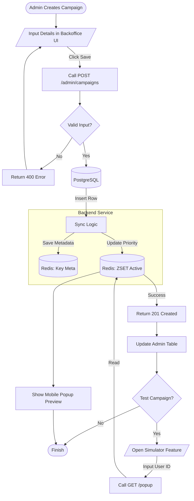

# System Design: Campaign Management Backoffice

## Overview
Dokumen ini menjelaskan rancangan teknis untuk **Backoffice (Admin Panel)** yang digunakan oleh tim Marketing/Ops untuk mengelola Campaign. Aplikasi ini akan berkomunikasi dengan Backend Service via REST API yang telah tersedia.

## Technology Stack
- **Framework**: React.js / Next.js (Dashboard Template: Ant Design Pro / MUI).
- **State Management**: React Query (Server State) + Context API.
- **Preview**: Mobile View Simulation.

## Features & Modules

### 1. Dashboard Overview
Halaman utama untuk melihat status performa campaign secara real-time.
- **Metrics**: Total Active Campaigns, Total Impressions (Today).
- **Chart**: Trend Impression per jam.
- **Alerts**: Warning jika ada campaign overlap dengan prioritas sama.

### 2. Campaign Management (CRUD)
Mengelola siklus hidup campaign.
- **List View**: Tabel dengan filter (Active/Inactive, Date Range).
- **Create/Edit Form**:
    - **Basic Info**: Title, Priority (Score).
    - **Creative**: Image URL preview, Action URL.
    - **Scheduling**: Date Time Picker (Start - End).
    - **Rules**: Max Frequency Cap.
    - **Audience**: Pilihan Target Type (ALL vs SEGMENT).

### 3. Audience Management (Targeting)
Fitur khusus untuk mengelola segmentasi user (VIP, New User, dll).
- **Segment List**: View daftar segment.
- **Upload CSV**: Upload file berisi list `user_id` untuk dimasukkan ke Redis Bitmap (`campaign:{id}:users`).
    - *Flow*: Admin upload CSV -> Service Parse -> Pipeline `SETBIT` ke Redis.

### 4. Live Preview / Simulator
Alat bantu QA/Marketing untuk memastikan popup muncul sesuai logika.
- Input: `User ID` (e.g., 777).
- Action: Hit API `GET /v1/campaigns/popup?user_id=777`.
- Output: Render tampilan HP dengan popup yang terpilih (atau pesan "No Popup").

## UI Wireframes (Concept)

### Campaign Form Layout
```
+-------------------------------------------------------+
|  [< Back]  Create New Campaign                        |
+---------------------------------------+---------------+
|  Title: [ Promo Gajian             ]  |  PREVIEW      |
|  Priority: [ 100 ] (High = Win)       |               |
|                                       |  +---------+  |
|  [x] Active                           |  |  Image  |  |
|                                       |  |         |  |
|  Schedule:                            |  |  Title  |  |
|  [ Start Date ] - [ End Date ]        |  |  [BTN]  |  |
|                                       |  +---------+  |
|  Targeting:                           |               |
|  (o) All Users                        |               |
|  ( ) Segment [ Upload CSV... ]        |  (Live View)  |
|                                       |               |
|  Limits:                              |               |
|  Freq Cap: [ 3 ] times/user           |               |
|                                       |               |
|  [ CANCEL ]        [ SAVE CAMPAIGN ]  |               |
+---------------------------------------+---------------+
```

## Integration Points

Backoffice akan bertindak sebagai Client untuk Admin API yang sudah ada.

| Feature | Endpoint | Method |
| :--- | :--- | :--- |
| **List Campaigns** | `/admin/campaigns` | `GET` |
| **Detail Campaign** | `/admin/campaigns/detail?id=X` | `GET` |
| **Create Campaign** | `/admin/campaigns` | `POST` |
| **Update Campaign** | `/admin/campaigns` | `PUT` |
| **Delete Campaign** | `/admin/campaigns` | `DELETE` |
| **Test Popup** | `/v1/campaigns/popup?user_id=X` | `GET` |
| **Sync Redis** | `/debug/sync` | `POST` |

## Security Considerations
Mengingat ini adalah Backoffice Internal:
1.  **Authentication**: Integrasi dengan SSO Kantor (Google Workspace / LDAP) atau minimal Basic Auth / JWT Login.
2.  **Audit Log**: Mencatat siapa yang membuat/mengedit campaign (via `created_by` field di DB).

## Process Flowchart

### Campaign Creation & Sync Flow


