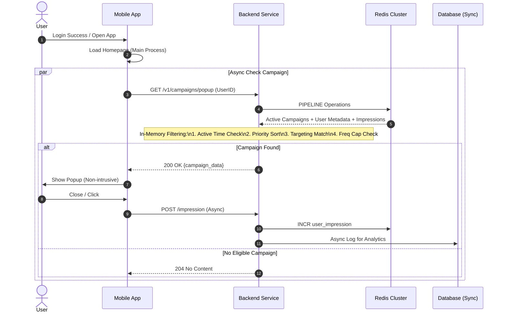

# System Design: High Performance Campaign Popup

## Goal
Menampilkan popup campaign kepada nasabah setelah login dengan performa tinggi, non-blocking, dan memiliki kontrol penuh terhadap targeting, frekuensi, dan prioritas.

## Key Principles & Requirements
1.  **Non-blocking**: API popup dipanggil secara *asynchronous* setelah login/load homepage selesai, atau di-prefetch. UI tidak boleh diam menunggu response.
2.  **Low Latency**: Target response time < 50ms (99th percentile). Menggunakan Caching (Redis) secara agresif.
3.  **Targeting**: Support specific user assignment & user segments.
4.  **Priority Resolution**: Menangani overlap campaign dengan sistem skor/prioritas.
5.  **Frequency Capping**: Membatasi jumlah muncul (e.g., max 1x per hari, 3x total).

## Architecture Overview

### Components
1.  **Mobile App (Client)**
    - Trigger: `After Login Success` OR `Homepage Mounted`.
    - Action: Call `GET /v1/campaigns/popup`.
    - Behavior: Silent fail jika error/timeout. Tampilkan jika ada data.
2.  **Campaign Service (Backend)**
    - Logic sentral untuk filtering dan sorting.
3.  **Redis (Cache)**
    - **Active Campaigns**: List campaign yang sedang berjalan (kecil, read-heavy).
    - **User Assignments**: Set user ID yang di-target (jika campaign spesifik user).
    - **User Impressions**: Counter berapa kali user melihat campaign X (ttl: campaign end).
4.  **Database (Persistence)**
    - Source of truth untuk reporting dan setup campaign.

## Design Solution

### 1. Data Structure (Redis Optimized)

Untuk mencapai kecepatan tinggi, kita hindari query complex ke DB saat runtime.

*   **Global Active Campaigns** (Key: `campaigns:active`)
    - Type: `ZSET` (Sorted Set) by Priority.
    - Value: `campaign_id`.
    - Background worker syncs DB -> Redis setiap menit.

*   **Campaign Metadata** (Key: `campaign:{id}:meta`)
    - Type: `HASH`.
    - Fields: `title`, `image_url`, `action_url`, `max_frequency`, `target_segment`, `start_time`, `end_time`.

*   **User Assignment (Whitelisting)** (Key: `campaign:{id}:users`)
    - Type: `BITMAP` (Sangat hemat memori untuk jutaan user jika ID berurutan) atau `SSET` (bloom filter jika memori terbatas).
    - Check: `GETBIT campaign:{id}:users {user_id_int}`.

*   **User Impressions** (Key: `user:{id}:impressions`)
    - Type: `HASH`.
    - Field: `{campaign_id}` -> Count.
    - TTL: Expire besok (jika daily cap) atau sesuai campaign.

### 2. Logic Flow (Get Popup)

Saat `GET /v1/campaigns/popup?user_id=123` dipanggil:

1.  **Fetch Candidates**: Ambil semua campaign ID dari `campaigns:active` (ZREVRANGE 0 -1). Urut berdasarkan prioritas tertinggi.
2.  **Pipeline Redis Check** (Lakukan dalam 1 round-trip network/`MGET`/Pipeline):
    - Check metadata campaign.
    - Check user assignment (Apakah user target campaign ini?).
    - Check impression count user saat ini.
3.  **Evaluation (In-Memory)**:
    - Loop kandidat dari prioritas tertinggi.
    - **Time Check**: `now()` within `start` & `end`?
    - **Target Check**: Apakah campaign global? Jika tidak, apakah user ada di whitelist?
    - **Cap Check**: Apakah `current_impression < max_frequency`?
4.  **Selection**: Ambil **kandidat pertama** yang lolos semua check.
5.  **Return**: JSON object popup or 204 No Content.

### 3. Impression Tracking (Async)

Saat client menampilkan popup:
1.  Fire & Forget request ke `POST /v1/campaigns/101/impression`.
2.  Backend `INCR` counter di Redis `user:{id}:impressions`.
3.  Push event ke Message Queue (Kafka/RabbitMQ) untuk persist ke DB (Analytics).

## Sequence Diagram

