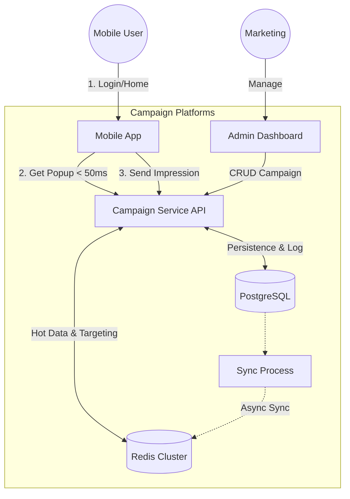

# High Level Solution: Campaign Management System

## 1. Executive Summary
Sistem Campaign Popup dirancang untuk memberikan pesan promosi (popup) kepada nasabah secara real-time, personal, dan non-intrusive. Sistem ini memprioritaskan **kecepatan (latency < 10ms)** dan **skalabilitas** tinggi untuk menangani jutaan nasabah per hari.

Solusi terpilih menggunakan pendekatan **Redis-First Strategy** untuk data delivery ke client, sementara **PostgreSQL** bertindak sebagai *source of truth* dan audit log administrasi.

## 2. Solution Architecture

### Top-Level Diagram

### Key Components

1.  **Campaign Service (Go)**:
    *   Backend utama yang melayani traffic user dan admin.
    *   Stateless & Horizontal Scaling.
    *   Logic: Priority Filtering, Frequency Capping, Time Checking.

2.  **Redis (Cache & State)**:
    *   Menyimpan data Campaign Aktif, Metadata, dan Whitelist User.
    *   Menyimpan state *Impression Counter* user (frequency cap).
    *   Menjamin response time super cepat.

3.  **PostgreSQL (Database)**:
    *   Menyimpan data master Campaign (Active & History).
    *   Menyimpan log impression untuk kebutuhan Analytics/Reporting.
    *   Source of truth agar data aman jika Redis restart.

4.  **Backoffice (Admin Panel)**:
    *   Web Dashboard untuk tim Marketing membuat campaign.
    *   Fitur: Create, Preview (Simulator), Upload Target Segment.

## 3. Data Flow Strategy

### A. Delivering Popup to User (Read Path)
*Goal: Speed.*
1.  API cek **Redis** `campaigns:active`.
2.  API cek **Redis** `campaign:{id}:users` (Targeting) & `user:{id}:impressions` (Frequency).
3.  Logic filtering terjadi di memori Server Go.
4.  Data dikembalikan ke user. **Tanpa hit ke DB sama sekali**.

### B. Impression Tracking (Write Path)
*Goal: Accuracy & Performance.*
1.  User melihat popup -> Hit API Impression.
2.  API Increment Counter di **Redis** (Real-time cap update).
3.  API menyimpan log ke **DB** (Async/Batch) untuk reporting.

### C. Campaign Sync (Admin Path)
*Goal: Consistency.*
1.  Admin Save Campaign -> Masuk **DB**.
2.  Backend otomatis trigger **Sync** ke Redis (Insert data ke ZSET & Hash).
3.  Campaign langsung live di User detik itu juga.

## 4. Scalability & Limits

| Parameter | Strategy |
| :--- | :--- |
| **Max Users** | Unlimited. Redis Bitmap/Set sharding strategy for targeting. |
| **Throughput** | 10k+ TPS. Scale out Go Service & Redis Cluster. |
| **Data Integrity** | Redis Persistence (AOF/RDB) + DB Backup. |
| **Deployment** | Kubernetes (Pod-based scaling). |

## 5. Technology Stack Selected
*   **Language**: Golang 1.25 (High concurrency).
*   **Cache**: Redis 7.x (Sorted Set, Bitmap, Hash).
*   **Database**: PostgreSQL 16 (JSONB support).
*   **Docs**: Swagger/OpenAPI v2.

---
*Dokumen ini adalah acuan arsitektur final untuk fase implementasi.*
