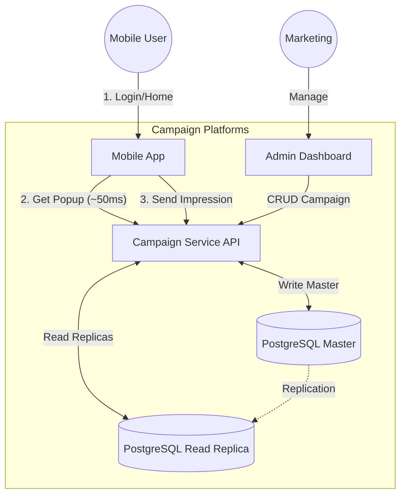

# High Level Solution: Campaign Management System (Alternative: No Redis)

## 1. Executive Summary
Dokumen ini menjelaskan arsitektur alternatif untuk Sistem Campaign Popup yang mengutamakan **kesederhanaan infrastruktur (Simplicity)** dan **konsistensi data (Strong Consistency)** dengan meniadakan layer caching eksternal (Redis).

Solusi ini menggunakan pendekatan **Pure PostgreSQL Strategy**. Semua operasi logic, retrieval, dan tracking dilakukan langsung terhadap database, cocok untuk sistem dengan traffic menengah atau resource infrastruktur terbatas.

## 2. Solution Architecture

### Top-Level Diagram



### Key Components

1.  **Campaign Service (Go)**:
    *   Backend logic tetap sama (Filtering rules).
    *   Perubahan: Tidak ada Redis Adapter. Repository pattern langsung ke SQL.
    *   Memanfaatkan connection pooling yang efisien.

2.  **PostgreSQL (Master & Read Replicas)**:
    *   **Master**: Menangani operasi tulis (Create Campaign, Insert Impression).
    *   **Read Replicas**: Menangani traffic `GET /popup` dari user untuk load balancing.
    *   Mengandalkan **Indexing** yang agresif untuk performa query cepat.

3.  **Backoffice (Admin Panel)**:
    *   Sama seperti solusi utama, melakukan CRUD ke API -> DB Master.

## 3. Data Flow Strategy

### A. Delivering Popup to User (Read Path)
*Goal: Simplicity.*
1.  API query SQL ke **DB Replica**.
    ```sql
    SELECT * FROM campaigns c 
    JOIN campaigns_targets t ON t.camp_id = c.id 
    WHERE c.is_active = true AND t.user_id = ?
    ORDER BY priority DESC LIMIT 5
    ```
2.  API query SQL cek Impression Count user ini.
3.  Logic filtering final di Go Service.
4.  Return response. Latency estimasi: **20ms - 100ms** (tergantung beban IO DB).

### B. Impression Tracking (Write Path)
*Goal: Durability.*
1.  User melihat popup -> Hit API Impression.
2.  API melakukan `INSERT` log ke **DB Master**.
3.  Optional: Gunakan *Unlogged Table* atau *Buffer Table* jika write load sangat tinggi untuk mengurangi beban WAL (Write Ahead Log).

### C. Campaign Sync (Admin Path)
*Goal: Real-time.*
1.  Admin Save Campaign -> Insert ke **DB Master**.
2.  Data otomatis ter-replikasi ke Replica (biasanya < 1 detik lag).
3.  Campaign live.

## 4. Scalability & Limits

| Parameter | Strategy |
| :--- | :--- |
| **Max Users** | Tergantung ukuran DB (Scale Up / Partitioning). |
| **Throughput** | Medium (~2k TPS). Dibatasi oleh IOPS Database & Connection Limits. |
| **Data Integrity** | Sangat Tinggi (ACID Compliant). |
| **Cost** | Lebih murah (menghilangkan biaya cluster Redis), tapi mungkin perlu instance DB lebih besar. |

## 5. Trade-off Analysis (vs Redis Solution)

*   **Keuntungan**:
    *   Stack teknologi sangat ramping (Hanya App + DB).
    *   Maintenance lebih mudah (One single source of truth).
    *   Tidak ada isu inkonsistensi data "tanggung" (DB vs Cache).
*   **Kelemahan**:
    *   Latency lebih tinggi dibanding Redis.
    *   Resiko *Database Overload* jika terjadi lonjakan traffic user (karena semua hit DB).
    *   Frequency cap global "mahal" secara query (harus `COUNT(*)`).

---
*Dokumen ini adalah alternatif desain untuk skenario resource terbatas atau traffic moderat.*
